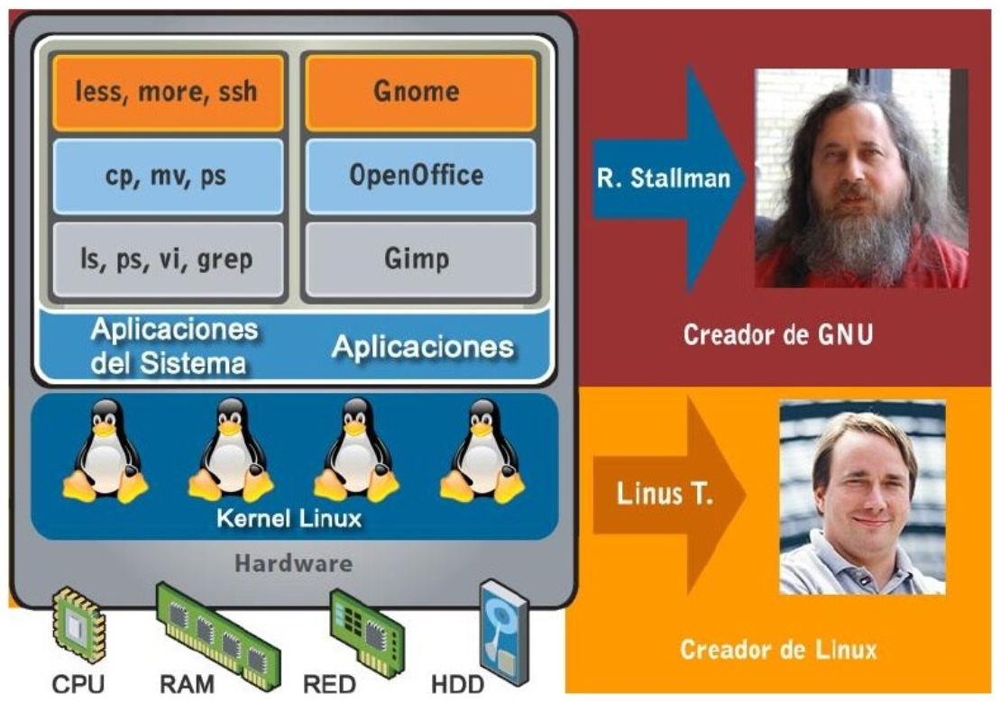
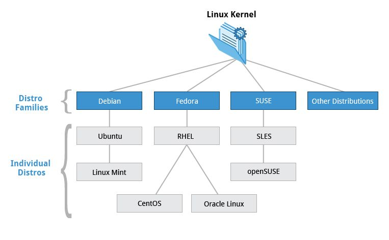
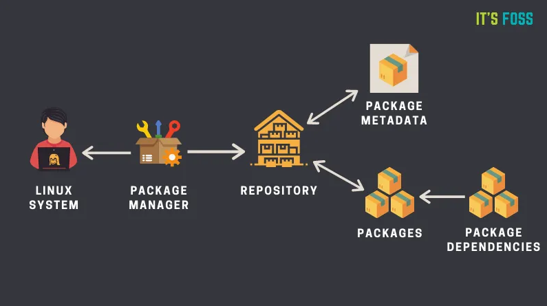
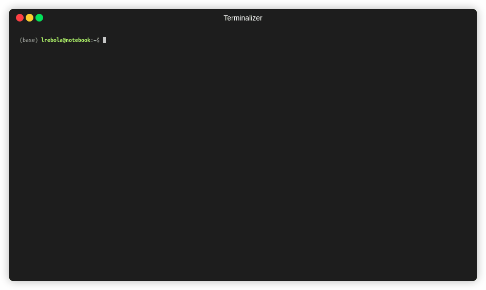
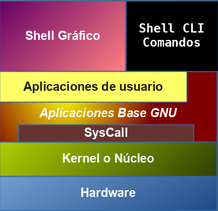

# 1. Intro Exprés


## GNU/Linux, que és

- Linux
- Proyecto GNU

|  | 
|:--:| 
| *Image from: https://pt.slideshare.net/jmacostarendon/introduccin-a-gnulinux/7* |

## Distribuciones

### Algunas distribuciones más conocidas:

|  | 
|:--:| 
| *Image from: https://analyticsindiamag.com/10-most-stable-linux-distros-in-2021/* |


### Árbol de distribuciones


### Familias de distribuciones

- Distribuciones GNU/Linux basada en otras.

|  | 
|:--:| 
| *Image from: https://ar.pinterest.com/pin/494129390339608968/ Fedora es fork de Red Hat* |

- Debian
- Red Hat
- Slackware
- ArchLinux
- Gentoo

### Distribuciones empresariales
- Disponible a través de una suscripción.
- No depende únicamente del respaldo de la comunidad.
- Diseñadas para satisfacer necesidades y problemas comerciales.
- Soporte técnico especializado y acceso a capacitaciones y recursos.

### Distribuciones y sistemas de gestión de paquetes

|  | 
|:--:| 
| *Image from: https://itsfoss.com/package-manager/* |

- DPKG – Debian Package Management System (**.deb**). Familia Debian.
- RPM - Red Hat Package Manager (**.rpm**). Familia Red Hat.
- Pacman Package Manager – Arch Linux
- Otros
- Compilación el código fuente.


## Intérprete de comandos (shell)



### Arquitectura



```console
lrebola@notebook:~$
```

### ¿Qué es un comando?

La mayoría de los comandos siguen un patrón simple de sintaxis:

```console
comando [opciones…] [argumentos…]
```

| - |Descripción|
|:--:|--|
|Comandos|Los nombres de los comandos siempre se escriben en minúsculas.|
|Opciones|Las opciones se escriben anteponiendo un guion y pueden ser varias juntas.|
|Argumentos|Todos los argumentos/parámetros se separan por espacios.|
|;|Ejecuta los comandos secuencialmente aunque encuentre algún error.|
|&&|Ejecuta el siguiente comando sólo si el anterior no contiene error.|

Ejemplos:
```console
$ ls -lh /path/to/directory/
```

Si un comando no existe:
```console
$ pepe
bash: pepe: command not found
```

Separador de comandos
```console
$ programa1;programa2 arg1 arg2;programa3
```

```console
$ programa1&&programa2 arg1 arg2&&programa3
```

En múltiples lineas:
```console
$ programa1 arg1 \
arg2 \
arg3
```