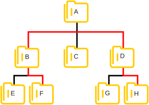
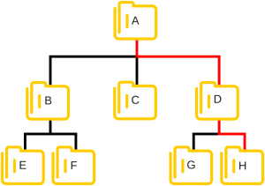
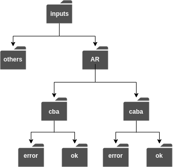
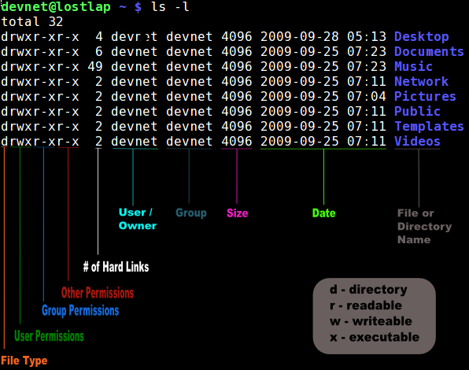
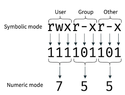
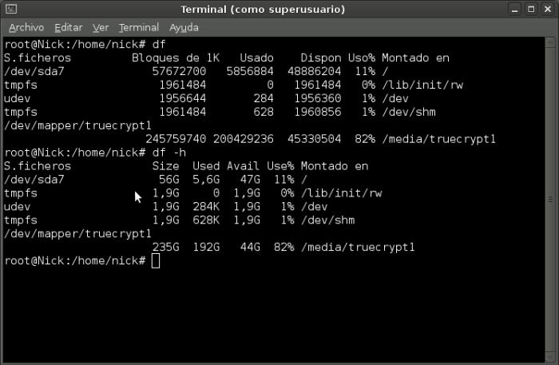
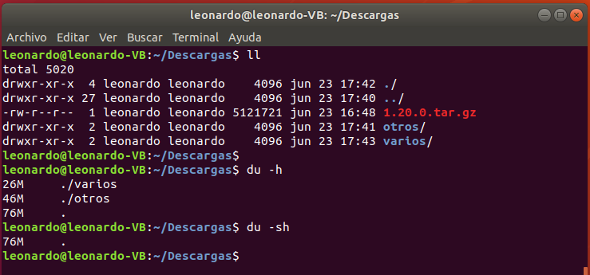

# 2. SISTEMA DE FICHEROS Y COMANDOS


---

## Sistema Jerárquico

- Filesystem Hierarchy Standard (FHS).


---

## Rutas absolutas, relativas y directorio de trabajo

**Paths (o rutas):**
- absolutos
- relativos

|  | 
|:--:| 
| *Image from: https://thelinuxalchemist.files.wordpress.com/2018/06/estructura1.png* |

**Comandos:**
- **cd**: cambiar de directorio.
- **ls**: listar contenido de un directorio.
- **pwd**: ver el directorio actual.

**¿Cómo llegar desde el directorio F hasta el H?**

Usando path relativo
```console
user@linux:/A/B/F$ cd ../../D/H/
```

|  | 
|:--:| 
| *Image from: https://thelinuxalchemist.files.wordpress.com/2018/06/relativa.png* |

Usando path absoluto
```console
user@linux:/A/B/F/$ cd /A/D/H/
```

|  | 
|:--:| 
| *Image from: https://thelinuxalchemist.files.wordpress.com/2018/06/absoluta.png* |

**Notaciones especiales:**

| Símbolo |Descripción|
|:--:|--|
|~|Directorio de usuario.|
|\-|Histórico del último directorio accedido.|
|.|Directorio actual.|
|:|Directorio superior al actual.|

Ejemplos:

- Ir al directorio del usuario
```console
leonardo@linux:/A/B/F$ cd ~

leonardo@linux:~$ pwd
/home/leonardo
```

ó

```console
leonardo@linux:/A/B/F$ cd

leonardo@linux:~$ pwd
/home/leonardo
```

- Navegar al último directorio visitado
```console
leonardo@linux:~$ pwd
/home/leonardo

leonardo@linux:~$ cd -
/A/B/F

leonardo@linux:/A/B/F$ cd -
/home/leonardo
```

- Listar el contenido de un directorio
```console
leonardo@linux:~$ ls .
Descargas  Documentos  Escritorio  Imágenes  Música  Plantillas  Público   Vídeos
```

ó

```console
leonardo@linux:~$ ls
Descargas  Documentos  Escritorio  Imágenes  Música  Plantillas  Público   Vídeos
```

- Ver el path absoluto de donde estoy
```console
leonardo@linux:~/code/scripts$ pwd
/home/leonardo/code/scripts

leonardo@linux:~/code/scripts$ cd ..

leonardo@linux:~/code$ pwd
/home/leonardo/code
```

## Ver cual es el directorio actual

\# 1
```console
user@linux:/A/D/H/$ pwd
/A/D/H/
```

\# 2
```console
[user@linux H]$ pwd
/A/D/H/
```

## Directorio $HOME

- /home/**username**/
- cd

Si hay más de un usuario:
- /home/user1/
- /home/user2/
- /home/user3/

Directorio home como variable de entorno:
```console
[leonardo@linux:~]$ echo $HOME
/home/leonardo
```

---

## Mover, renombrar y copiar ficheros

### Comandos:
- mv
- cp
- rm

**Trabajando con archivos**
 
Copiar un archivo dentro del mismo directorio
```console
[user@linux workspace]$ cp hola-mundo.java hola-mundo.java.backup
```

Copiar un archivo a otro directorio
```console
[user@linux workspace]$ cp app.log ../app.log
```

Renombrar un archivo
```console
[user@linux workspace]$ mv hola-mundo.java hello-world.java
```

Mover un archivo
```console
[user@linux workspace]$ cp hola-mundo.java ../hola-mundo.java
```

Eliminar un archivo
```console
[user@linux workspace]$ rm hola-mundo.java
```

**Trabajando con directorios**

Copiar un directorio con todo su contenido

```console
[user@linux workspace]$ cp -r logs backups/logs
```

Copiar un directorio con todo su contenido y renombrarlo en el mismo paso

```console
[user@linux workspace]$ cp -r logs backups/logs-2021-JUL
```

Renombrar un directorio
```console
[user@linux workspace]$ mv logs logs-old
```

Renombrar un directorio
```console
[user@linux workspace]$ rm -rf logs
```

---

## Práctico 1

_Tip: Puede precionar dos veces la tecla tabulador para autocompletar._

1. Crear los siguientes directorios adentro de $HOME:



2. Renombrar el directorio **others** por **temp**.
3. Navegar desde el directorio **\$HOME/inputs/AR/cba/error** a **\$HOME/inputs/AR/caba/ok** usando path relativo.
4. Ahora regresar al path anterior usando "**cd -**" y realice el ejercicio anterior pero usando path absoluto.
5. Ingresar al directorio **/data/files/** y copiar el directorio **titanic-dataset** con todo su contenido adentro **\$HOME/inputs/AR/cba/ok** y renombrandolo en el mismo paso como titanic.

---

## WildCards

| Símbolo |Descripción|
|:--:|--|
|**\***|coincidirá con uno o más caracteres.|
|**?**|coincidirá exactamente con un carácter.|
|**[]**|coincidirá con cualquier ocurrencia de caracteres listados.|

Ejemplos: \*
```console
leonardo@linux:~/Descargas$ ls
file-2019-06-24-01-00-00.csv
file-2019-06-24-02-00-00.csv
file-2019-06-24-03-00-00.csv
file-2019-06-24-04-00-00.csv
file-2019-06-24-05-00-00.csv
file-2019-06-24-06-00-00.csv 

#1
leonardo@linux:~/Descargas$ ls file-2019-07-*

#2
leonardo@linux:~/Descargas$ ls file-2019-07-*.csv

#3
leonardo@linux:~/Descargas$ mv file-2019-06-*.csv ../Documentos/files/junio/
```

Ejemplos: ?
```console
#1
leonardo@linux:~/Descargas$ ls
house mouse grouse

leonardo@linux:~/Descargas$ ls ?ouse
house mouse

#2
leonardo@linux:~/Descargas$ ls
list.sh speaker.sh lost.sh 

leonardo@linux:~/Descargas$ ls l?st.sh
list.sh lost.sh
```

Ejemplos: []
```console
#1
leonardo@linux:~/Descargas$ ls
file-2019-06-24-01-00-00.csv
file-2019-06-24-02-00-00.csv
file-2019-06-24-03-00-00.csv
file-2019-06-24-04-00-00.csv
file-2019-06-24-05-00-00.csv
file-2019-06-24-06-00-00.csv 

leonardo@linux:~/Descargas$ cp file-2019-06-24-0[4-6]-*.csv backup

#2
leonardo@linux:~/Descargas$ ls [m]ouse
list.sh speaker.sh lost.sh 

leonardo@linux:~/Descargas$ ls l[aeiou]st.sh
list.sh lost.sh

#3
leonardo@linux:~/Descargas$ ls l[a-zA-Z]st.sh
list.sh lost.sh
```

## Práctico 2

_Tip: Para listar el contenido de los directorios use **ls -l**_

1. Ingrese al directorio **\$HOME/inputs/AR/cba/ok/titanic**
2. Listar unicamente los archivos de junio.
3. Listar todos los archivos del día 1 y 6 sin importar el mes.

---

## Obtener información sobre archivos y directorios ##

- dueño
- tamaño
- permisos del archivo

Comando **ls**

```console
# ls -l:  Muestra usuario, grupo, permisos, tamaño, fecha y hora.

# ls -lh: Idem, pero con unidades de tamaño para "humano" (Kb, Mb, Gb).

# ls -a:  Incluye en el listado los archivos y directorios ocultos.

# ls -t:  Ordena por fecha de modificación.

# ls -X:  Ordena los archivos por extensión.

# ls -S:  Ordena los resultados por tamaño de archivo.

Todos los comandos anteriores se pueden combinar.
```

Comando **ls -l**



Ejemplos:

```console
#1
ls -l file.tar.gz 
-rw-r--r-- 1 leonardo leonardo 5121721 jun 23 16:48 file.tar.gz

#2
ls -lh file.tar.gz 
-rw-r--r-- 1 leonardo leonardo 4,9M jun 23 16:48 file.tar.gz

#3
ls -lh Descargas/
total 4,9M
-rw-r--r-- 1 leonardo leonardo 4,9M jun 23 16:48 1.20.0.tar.gz
drwxr-xr-x 2 leonardo leonardo 4,0K jun 23 17:41 otros
drwxr-xr-x 2 leonardo leonardo 4,0K jun 23 17:43 varios
```

## Práctico 3

1. ¿Dentro del directorio titanic hay algún archivo oculto?
2. Listar todos los archivos y:
    * Visualizar los tamaños de los archivos en formato "humano".
    * Ver quien es el usuario dueño del archivo.
    * Ver su fecha de modificación.


## Permisos ##

Consultar los permisos:


Asignar permisos:

```console
chmod [permisos] [file]

chmod -R [permisos] [directory]
```

|  | 
|:--:| 
| *Image from: https://www.booleanworld.com/wp-content/uploads/2018/04/43260_115.png* |

```console
chmod 755 file.txt
```

```console
chmod -R 755 /other/directory/
```

- https://chmod-calculator.com/

### Cambiar usuario/grupo dueño de un archivo o directorio:
```console
$ chown usuario[:grupo] archivo(s) o directorio(s)

$ chown -R usuario[:grupo] archivo(s) o directorio(s)

# entre [] lo opcional (grupo).
```

Ejemplo:
```console
$ chown homero archivo.txt
```

```console
$ chown homero:cantinademoe archivo.txt
```

```console
$ chown -R homero /datos/logs/app_homero/
```

### Cambiar grupo dueño de un archivo o directorio:

```console
$ chgrp grupo archivo(s) o directorio(s)
```

Ejemplo:

```console
$ chgrp cantinademoe archivo.txt
```

## Información sobre el sistema de archivos ##

- df: Disk Free
- du: Disk Usage

```console
df -h
```



```console
du -sh
```



## Compresión y descompresión de ficheros ##

- gzip
- gunzip
- zip
- tar
- zcat

### GZIP

```console
Comando: gzip
```

Comprimir:

```console
gzip filename
```

```console
gzip file1 file2 file3
```

Descomprimir:

```console
gzip -d filename.gz
```

Parámetros útiles:

```console
gzip -f filename

# -f: force
```

```console
gzip -k filename

# -k: keep the original file
```

```console
gzip -r foldername

# -r: recursive
```

```console
gzip -t filename

# -t: test
```


### GUNZIP

```console
Comando: gunzip
```

Descomprimir
```console
gunzip workspace.gz
```

```console
gunzip -k workspace.gz
```

```console
gunzip -t workspace.gz
```


### ZIP

```console
Comando: zip
```

Comprimir
```console
zip myfile.zip filename.txt
```

Descomprimir

```console
unzip filename
```

### TAR

```console
Comando: tar
```

Empaquetar/Comprimir

```console
tar -cvf workspace.tar workspace
```

```console
gzip workspace.tar
```

Todo en uno:

```console
tar -cvzf workspace.tar.gz workspace
```

Desempaquetar/Descomprimir

```console
gunzip workspace.tar.gz
```

```console
tar -xvf workspace.tar
```

Todo en uno:

```console
tar -xvzf workspace.tar.gz
```

Parametros
```console
c – create a archive file.
x – extract a archive file.
v – show the progress of archive file.
f – filename of archive file.
z – filter archive through gzip.

Nota: tar.gz = tgz
```

### ZCAT

```console
Comando: zcat
```

Mostrar contenido:

```console
zcat workspace.gz
```

```console
zcat workspace.gz | more
```

```console
zcat workspace.gz | less
```
