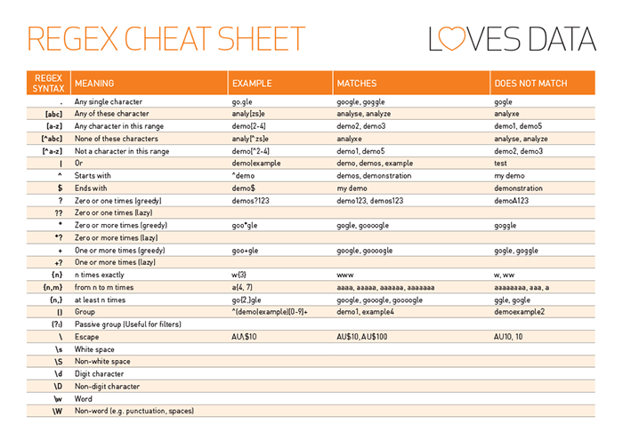

# 2. SISTEMA DE FICHEROS Y COMANDOS

## Visualizar ficheros

- cat
- tail
- head
- more
- less

### cat
- Para archivos chicos, de pocas lineas

```console
cat filename.txt
```

```console
cat -n filename.txt

# n: Para mostrar los números de línea.
```

```console
cat -v filename.txt

# v: Para mostrar caracteres no imprimibles.
```

### tail

- Forma básica
```console
tail filename.txt
```

- Ver ultimos 5 registros
```console
tail -5 filename.txt
```

- Ver en vivo nuevos registros
```console
tail -f filename.txt
```

### head

- Forma básica

```console
head filename.txt
```

- Ver primeros 5 registros
```console
head -5 filename.txt
```

### more
- Archivos grandes

```console
more filename.txt
```

- Para pasar a la página siguiente: presionar la barra espaciadora.
- Se puede buscar presionando: shift + /
- Para salir: Presionar la tecla «q».

### less
- Archivos grandes


```console
$ less filename.txt
```

Opciones útiles:

```console
$ less -N filename.txt

# Mostrar el número de cada línea
```

```console
$ less -p BUSCAR_ALGO filename.txt
```

```console
$ less +n filename.txt

# Muestra el archivo desde la linea n
```

```console
$ less -M filename.txt

# Muestra información: cantidad de lineas, % de avance
```

```console
$ less +F filename.txt

# Idem a: tail -f filename.txt
```

Más:
```console
Navegación:

- Teclas de Flechas/AvPag/RePag/Inicio/Fin: .
- g: Ir al final del texto. 
- G: Ir al inicio del texto. 
- Ng: Saltar a línea número N.

Búsqueda:

- /: Ingresar una palabra a ser buscada avanzando dentro del texto. Se pueden utilizar expresiones regulares.
- ?: Ingresar una palabra a ser buscada retrocediendo dentro del texto. Se pueden utilizar expresiones regulares.
- n: Ir a siguiente coincidencia (después de una búsqueda).
- N (shift + n): Ir a coincidencia anterior (después de una búsqueda).

- q: salir
```

### Ejercicios
1. Probar el comando cat con uno de los archivos de "$HOME/inputs/AR/cba/ok/titanic"
2. Probar los comandos head, tail y less con el archivo "titanic.csv" que les facilitaré.
3. Buscar en el archivo "titanic.csv" usando less, si hay personas llamadas "Charles". Practicar avanzar y retroceder en la búsqueda.

## Filtros

- grep
- sed
- cut

### grep

```console
grep [opciones] pattern [ARCHIVO]
```

- [opciones]: modificadores del comando.
- pattern: el patrón que queremos encontrar con la búsqueda.

Algunas opciones:

    -i: la búsqueda no distinguirá entre mayúsculas y minúsculas.
    -c: solo mostrará el número de líneas que coinciden con el patrón buscado.
    -r: habilita la búsqueda recursiva en el directorio actual.
    -n: busca líneas y precede cada línea coincidente con su número de línea.

- Forma básica
```console
grep TEXTO_BUSCAR filename.txt
```

- Si la cadena de búsqueda incluye espacios, debe estar entre comillas
- Es recomendable siempre usar las comillas, aunque no haya espacios
```console
grep "Hola Mundo" filename.txt
```

- Ignorar mayúsculas y minúsculas
```console
grep -i TEXTO_BUSCAR filename.txt
```
- Conteo de palabras que coinciden con la búsqueda
```console
grep -c TEXTO_BUSCAR filename.txt
```
- Buscar una palabra en un conjunto de archivos
```console
grep TEXTO_BUSCAR *.txt
```

- Buscar en un directorio de manera recursiva
```console
grep -r TEXTO_BUSCAR /path/to/directory/
```

### Ejercicios

1. Buscar entre los archivos de "$HOME/inputs/AR/cba/ok/titanic" si entre los pasajeros del titanic había una mujer llamada: Lucile Polk


### grep y las expresiones regulares básicas

#### Expresiones Regulares o regex

- Son un patrón de búsqueda.
- Proporcionan una manera flexible de buscar



Regex cheat sheet: https://cheatography.com/doublehelix/cheat-sheets/the-complete-regex/


```console
grep -E 'REGEX' filename.txt
```

### Ejercicios:

Usando la web: https://regex101.com/

1. Usar el siguiente texto para verificar si existe la palabra "casos" o "dispositivo":

```console
En informática, Hola mundo es un programa que imprime el texto «¡Hola, mundo!» en un dispositivo de visualización, en la mayoría de los casos la pantalla de un monitor. Este programa suele ser usado como introducción al estudio de un lenguaje de programación, siendo un primer ejercicio típico, y se considera fundamental desde el punto de vista didáctico.
```

2. Teniendo el siguiente listado de nombres de archivos debe varidar que obligatoriamente todos comiencen con prefijo "titanic" y finalicen con la extensión ".csv".

```console
titanic_20210601.csv
titanic_20210605.csv
titanic_20210611.csv
titanic_20210619.csv
titanic_20210626.csv
titanic_20210701.csv
titanic_20210706.csv
titanic_20210709.csv
titanic_20210715.csv
```

3. Hacer una expresión regular que valide un texto de entrada con las siguientes características:
   - Debe comenzar con mayúsculas
   - Debe terminar con "." o ";"

4. Ahora en la shell, escribir un comando grep usando regex para buscar en el archivo "country-codes.csv" los registros para Argentina y Uruguay.

5. El mismo comando anterior, pero ignorando mayúsculas y minúsculas en Argentina y Uruguay.

### sed

- Sustituir un string en la primera aparición del patrón en cada línea
```console
$sed 's/male/female/' filename.txt

- s: especificamos la operación de sustitución.
- /: son delimitadores

-i: Si queremos que los cambios sean permanentes en el fichero
```

- Reemplazar todas las apariciones de un string en un texto
```console
$sed 's/male/female/g' filename.txt

- g: Reemplazo global 
```

- Reemplazar un string en un número de línea específico.
```console
$sed 'N s/male/female/' filename.txt
```


- Reemplazar un valor entre un rango de líneas.
```console
$sed 'N,M s/male/female/' filename.txt
```

- Borrar líneas de un fichero
```console
$sed 'Nd' filename.txt

- Donde N es un valor numérico.
- Si el valor de N es configurado como $ entonces borrará la ultima línea.
```

- Borrar un rango de líneas de un fichero
```console
$sed 'N,Md' filename.txt
```

### cut

```console
$ cut options myfile

# Parámetros más usados:

-f: Selecciona los campos (columnas) indicadas en el o los rangos.
-d: Especifica el carácter delimitador de los campos,
-s: Indica que las líneas que no posean el delimitador (o separador) no sean mostradas.
--output-delimiter: Indica que los campos, al ser mostrados en pantalla, sean separados por la cadena de texto indicada.
```

Ejemplos, casos típicos:

```console
$ cat archivo.csv
dato1,dato2,dato3,dato4,dato5,dato6

$ cut -f 2-4 -d "," archivo.csv
dato2,dato3,dato4

$ cut -f 2,4 -d "," archivo.csv
dato2,dato4

$ cut -f 2 -d "," archivo.csv
dato2
```

```console
$ cut -f 2-4 -d "," --output-delimiter="|" archivo.csv

dato2|dato3|dato4
```

### Ejercicios

1. Usando el archivo "country-codes.csv" solo retornar la columna "Country_Name" de los paises.

2. Usando el mismo archivo retornar las columnas "Country_Name", "ISO3166_1_Alpha_2" y "Dial". Formatear la salida con | como separador.

## Buscar archivos

```console
find /path/files -name "NOMBRE_ARCHIVO_S"
```

## Buscar texto en archivos

```console
grep -irn '/path/to/somewhere/' -e 'pattern'
```

Combinando find y grep 
```console
find . -name "*.csv" -exec grep -E 'Charles' {} \;
```

Dando color
```console
find . -name "*.csv" -exec grep -E --color -R 'Charles' {} \;
```