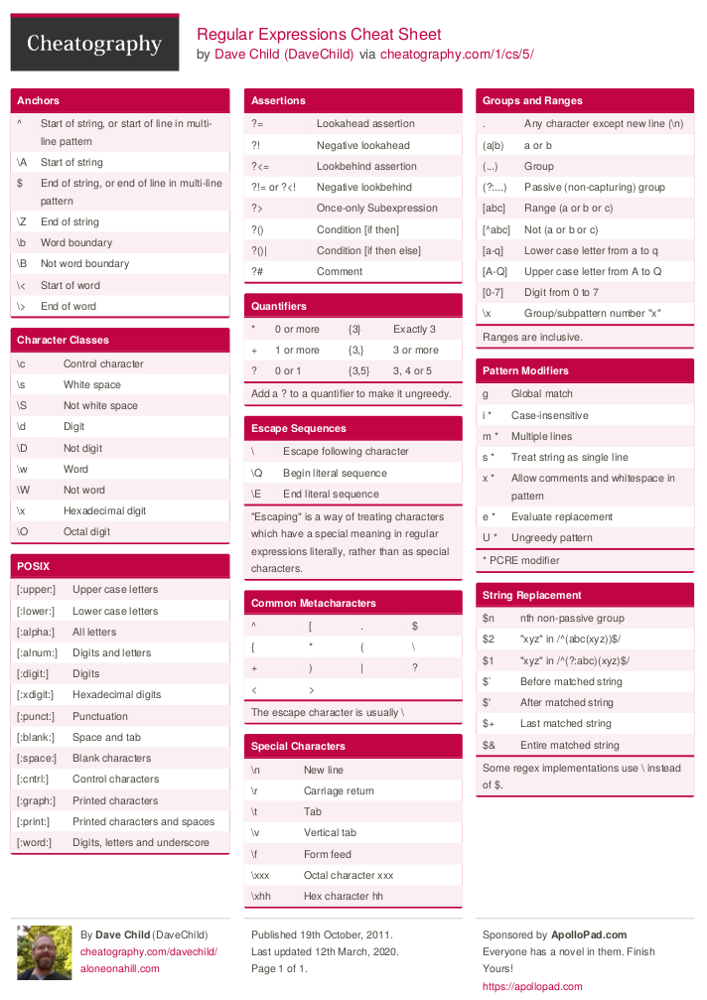

# 2. SISTEMA DE FICHEROS Y COMANDOS

## Visualizar ficheros

- cat
- tail
- head
- more
- less

### cat
- Para archivos chicos, de pocas lineas

```console
cat filename.txt
```

```console
cat -n filename.txt

# n: Para mostrar los números de línea.
```

```console
cat -v filename.txt

# v: Para mostrar caracteres no imprimibles.
```

### tail

- Forma básica
```console
tail filename.txt
```

- Ver ultimos 5 registros
```console
tail -5 filename.txt
```

- Ver en vivo nuevos registros
```console
tail -f filename.txt
```

### head

- Forma básica

```console
head filename.txt
```

- Ver primeros 5 registros
```console
head -5 filename.txt
```

### more
- Archivos grandes

```console
more filename.txt
```

- Para pasar a la página siguiente: presionar la barra espaciadora.
- Se puede buscar presionando: shift + /
- Para salir: Presionar la tecla «q».

### less
- Archivos grandes


```console
$ less filename.txt
```

Opciones útiles:

```console
$ less -N filename.txt

# Mostrar el número de cada línea
```

```console
$ less -p BUSCAR_ALGO filename.txt
```

```console
$ less +n filename.txt

# Muestra el archivo desde la linea n
```

```console
$ less -M filename.txt

# Muestra información: cantidad de lineas, % de avance
```

```console
$ less +F filename.txt

# Idem a: tail -f filename.txt
```

Más:
```console
Navegación:

- Teclas de Flechas/AvPag/RePag/Inicio/Fin: .
- g: Ir al final del texto. 
- G: Ir al inicio del texto. 
- Ng: Saltar a línea número N.

Búsqueda:

- /: Ingresar una palabra a ser buscada avanzando dentro del texto. Se pueden utilizar expresiones regulares.
- ?: Ingresar una palabra a ser buscada retrocediendo dentro del texto. Se pueden utilizar expresiones regulares.
- n: Ir a siguiente coincidencia (después de una búsqueda).
- N (shift + n): Ir a coincidencia anterior (después de una búsqueda).

- q: salir
```

## Filtros

- awk
- grep
- sed
- cut

### grep

```console
grep [opciones] pattern [ARCHIVO]
```

- [opciones]: modificadores del comando.
- pattern: el patrón que queremos encontrar con la búsqueda.

Algunas opciones:

    -i: la búsqueda no distinguirá entre mayúsculas y minúsculas.
    -c: solo mostrará el número de líneas que coinciden con el patrón buscado.
    -r: habilita la búsqueda recursiva en el directorio actual.
    -n: busca líneas y precede cada línea coincidente con su número de línea.

- Forma básica
```console
grep TEXTO_BUSCAR filename.txt
```

- Ignorar mayúsculas y minúsculas
```console
grep -i TEXTO_BUSCAR filename.txt
```
- Conteo de palabras que coinciden con la búsqueda
```console
grep TEXTO_BUSCAR filename.txt
```
- Buscar una palabra en un conjunto de archivos
```console
grep TEXTO_BUSCAR *.txt
```

- Buscar en un directorio de manera recursiva
```console
grep -r TEXTO_BUSCAR /path/to/directory/
```

### grep y las expresiones regulares básicas

#### Expresiones Regulares o regex

- Son un patrón de búsqueda.
- Proporcionan una manera flexible de buscar




### sed

- Sustituir un string en la primera aparición del patrón en cada línea
```console
$sed 's/male/female/' filename.txt

- s: especificamos la operación de sustitución.
- /: son delimitadores

-i: Si queremos que los cambios sean permanentes en el fichero
```

- Reemplazar todas las apariciones de un string en un texto
```console
$sed 's/male/female/g' filename.txt

- g: Reemplazo global 
```

- Reemplazar un string en un número de línea específico.
```console
$sed 'N s/male/female/' filename.txt
```


- Reemplazar un valor entre un rango de líneas.
```console
$sed 'N,M s/male/female/' filename.txt
```

- Borrar líneas de un fichero
```console
$sed 'Nd' filename.txt

- Donde N es un valor númerico.
- Si el valor de N es configurado como $ entonces borrará la ultima línea.
```

- Borrar un rango de líneas de un fichero
```console
$sed 'N,Md' filename.txt
```

### cut

```console
$ cut options myfile

# Parámetros más usados:

-f: Selecciona los campos (columnas) indicadas en el o los rangos.
-d: Especifica el caracter delimitador de los campos,
-s: Indica que las líneas que no posean el delimitador (o separador) no sean mostradas.
--output-delimiter: Indica que los campos, al ser mostrados en pantalla, sean separados por la cadena de texto indicada.
```

Ejemplos, casos típicos:

```console
$ cat archivo.csv
dato1,dato2,dato3,dato4,dato5,dato6

$ cut -f 2-4 -d "," archivo.csv
dato2,dato3,dato4

$ cut -f 2,4 -d "," archivo.csv
dato2,dato4

$ cut -f 2 -d "," archivo.csv
dato2
```

```console
$ cut -f 2-4 -d "," --output-delimiter="|" archivo.csv

dato2|dato3|dato4
```

## Buscar un texto entre varios archivos

