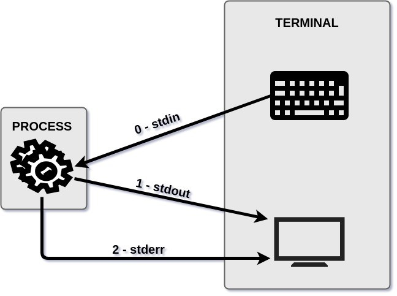
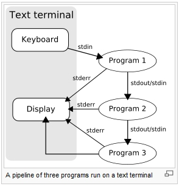

# 4. FLUJOS DE INFORMACIÓN #

## Redirigir flujos de información ##

|  | 
|:--:| 
| *Image from: codigofacilito.com* |

 ### Flujos de E/S (Entrada y Salida)

|Nombre|Descriptor de fichero|Destino por defecto|
|---|---|---|
|entrada estándar (stdin)|0|teclado|
|salida estándar (stdout)|1|pantalla|
|error estándar (stderr)|2|pantalla|



### Ejemplo:

- Descriptor 0 y 1
```console
ls /home/$USER

<resultado stdout>
```

- Descriptor 0 y 2
```console
ls /home/root/

ls: no se puede acceder a '/home/root': No existe el archivo o el directorio
```

### Redireccionamientos

- Redireccionar la salida

|Carácter|Resultado|
|-|-|
|comando > fichero |	Envía la salida de comando a fichero|; sobreescribe cualquier cosa de fichero|
|comando 2> fichero|	Envía la salida de error de comando a fichero (el 2 puede ser reemplazado por otro descriptor de fichero)|
comando >> fichero 	|Añade la salida de comando al final de fichero|
comando 2>&1 |	Envía la salida de error a la salida estándar (el 1 y el 2 pueden ser reemplazado por otro descriptor de fichero, p.e. 1>&2)|
comando &> fichero |	Envía la salida estándar y de error a fichero; equivale a comando > fichero 2>&1|
|aplicación 2 > /dev/null|Descartar salida error|


- Redireccionar la entrada

|Carácter|Resultado|
|-|-|
|comando < fichero |	Toma la entrada de fichero|

### Ejemplos

- **Redireccionar stdin desde fichero**
```console
# Si tenemos /home/$USER dentro del fichero path.txt
# Debemos recurrir al comando xargs

xargs ls 0< ruta.txt

ó equivalente:

xargs ls < ruta.txt
```

- **Redireccionar stdout a un fichero**
```console
$ ls -l /home/$USER 1> exito.txt

# ver el fichero
$ cat exito.txt
```

Nota: Podemos no especificar el descriptor 1

- **Redireccionar stdout a un fichero con adición**
```console
$ ls -l /home/$USER >> exito.txt

# ver el fichero
$ cat exito.txt
```

- **Redireccionar stderr a un fichero**
```console
$ ls -l /home/root 2> error.txt

# ver el fichero
$ cat error.txt
```

- **Redireccionar stderr a un fichero con adición**
```console
$ ls -l /home/root 2>> error.txt

# ver el fichero
$ cat error.txt
```

NOTA: Aquí para stderr no podemos ignorar escribir el descriptor 2.


- **Otros ejemplos**
```console
$ mycommand > mycommand.out 2> mycommand.err

# Redirigir la salida estándar y el error estándar a diferentes archivos.
```

```console
$ wc < archivo.txt
```

```console
$ grep < archivo.txt "Hola"
```

### Ejercicios:
1. Guardar el listado de archivos del titanic en un archivo llamado listado.txt
2. Usar grep para buscar a Lucile Polk entre los archivos del titanic y guardar el resultado en un fichero llamado resultados.txt


## Pipes (o Tuberías) ##

```console
$ comando1 | comando2
```


|  | 
|:--:| 
| *Image from: http://www.eservers-hosting.com/sys/know-foto/Pipelines.jpg* |

```console
$ cat archivo.txt | wc
```

```console
$ cat archivo.txt | grep "Hola"
```

### Ejercicios:
1. Contar la cantidad de archivos que hay en: /home/$USER/inputs/AR/cba/ok/titanic. Ayuda: usar ls y wc.
2. Buscar en el archivo country-codes.csv todos los países que comienzan con la letra M e imprimir en la terminal solo los nombres de los países. Ayuda: usar grep, regex y cut.